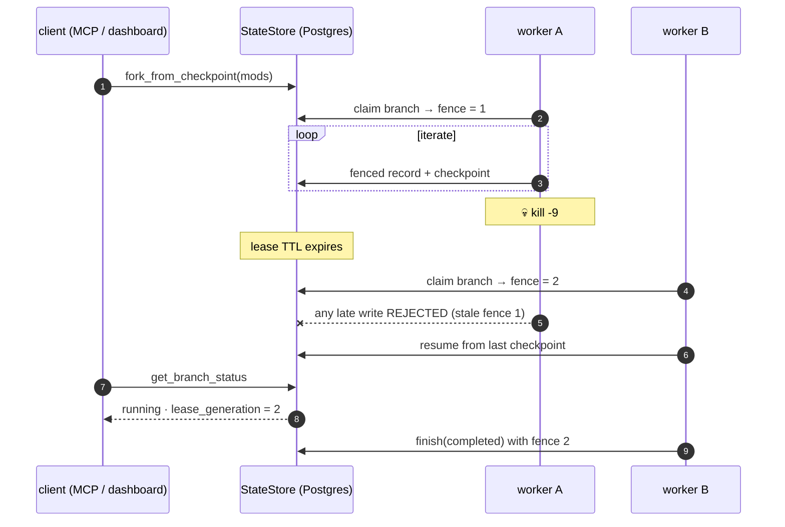
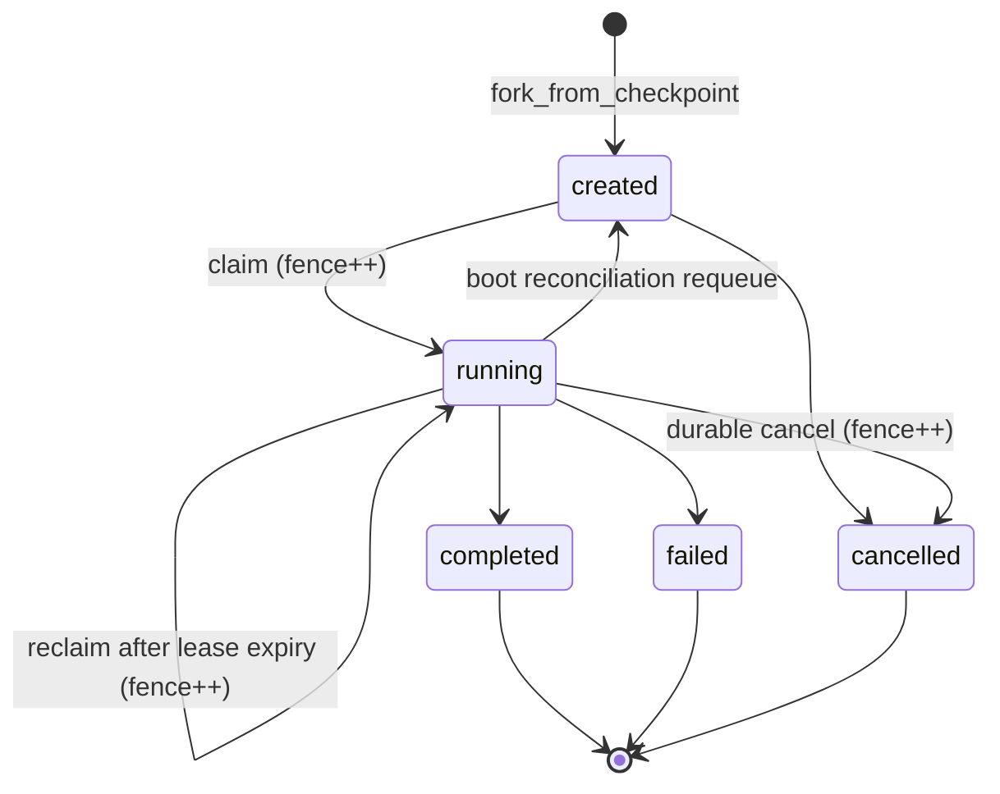
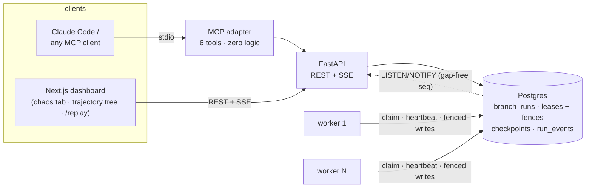

# Meta-Harness

> *A durable execution runtime for long-horizon agent workflows — checkpointed,
> forkable, crash-recoverable — verified by deterministic simulation testing.*


Every badge number is reproducible by a command in this README — that's a house
rule. Mock-bench scores follow a hardcoded fixture curve and are never presented
as measurements.

LangGraph gives a single thread checkpoint persistence and resume. This project
adds what it doesn't have: **branch lifecycle as durable state, lease-based
claiming with fencing tokens across processes, crash reconciliation on boot,
and fork-from-arbitrary-checkpoint with state mutation** — and proves those
mechanics with a seeded, fault-injecting simulator instead of hope.

The reference workload is a self-improving coding-agent harness search (after
the Stanford Meta-Harness paper,
[arXiv:2603.28052](https://arxiv.org/abs/2603.28052)). The workload has to
*run*; it is not the claim.

---

## The refinement layer: `harness`

On top of the runtime sits a coding-agent harness that improves through use
([`documents/VISION.md`](documents/VISION.md)): it observes real work, detects
recurring weaknesses **and the step where each one manifests**, proposes
harness changes, evaluates them by **forking the trajectory at that step** on
the durable runtime, and promotes only what clears a gate built on a measured
noise floor.

```bash
sh scripts/install.sh              # the `harness` binary; local mode = SQLite, no server
cd ~/my-repo && harness init       # empty harness H0, zero config
harness wrap claude                # your normal Claude Code session, observed via hooks
harness status                     # shows only deltas that cleared the gate
```

| | |
|---|---|
| a harness version **is** checkpoint state | every trajectory step records `(workspace snapshot, agent resume state, harness, memory version)` |
| a candidate **is** a branch | each candidate run is a fenced `branch_runs` row; workers stage, the trusted plane scores |
| a rollback **is** a fence increment | a reclaimed evaluation branch's late writes are rejected by the data layer |
| a promotion **is** `update_frontier` | parent archived, child active, evidence + hypothesis + evaluation recorded |

What is **proven** is mechanical: I1–I7 hold in local mode (SQLite, 10,000
seeds), evaluation runs are exactly-once under worker kills (E0), memory is
frozen during comparisons, the verifier is hidden and Docker-sandboxed, and a
real Claude Code trajectory can be forked mid-run and resumed under a
different harness. What is **open** is statistical: whether refinement
improves a real agent at an affordable cost. The experiments that answer it
(E1–E5) are built and pre-registered; results so far are on a seeded
synthetic agent and are labeled pipeline validation, never capability.

Details: [`docs/REFINEMENT.md`](docs/REFINEMENT.md) ·
departures from the spec: [`docs/DECISIONS.md`](docs/DECISIONS.md).

---

## The 15-second story: kill a worker, keep the run



This exact sequence is verified three independent ways:

| Proof | Command |
|---|---|
| Real processes, real SIGKILL | `cd backend && uv run pytest tests/test_worker_recovery.py -q` |
| Driven end-to-end by an outside MCP client | `cd backend && uv run pytest tests/test_mcp_acceptance.py -q` |
| Watchable live — the dashboard's **chaos tab** has per-worker `kill -9` buttons and a fence badge that ticks gen N → N+1 | `META_HARNESS_CHAOS=1 uv run uvicorn app.main:app` + two `uv run meta-harness worker` |

---

## What the runtime guarantees

The spec is [`docs/INVARIANTS.md`](docs/INVARIANTS.md); tests are named after
the invariant they cover, and the simulator asserts all seven after every
seeded run.

| ID | Invariant |
|---|---|
| I1 | No double execution — no iteration lands twice across any crash/resume sequence |
| I2 | No orphans — after boot reconciliation, no branch stays `running` without a live lease |
| I3 | Resume convergence — crash + resume reaches the same final state as an uninterrupted run |
| I4 | Fork isolation — a branch's writes never mutate parent thread state |
| I5 | Lease safety — at most one worker executes a branch (fencing tokens, not just TTLs) |
| I6 | Durable cancel — a cancelled branch never resumes, not even after restart |
| I7 | Event integrity — per-run SSE sequence numbers are monotonic with no gaps |

Branch lifecycle — every transition outside this diagram is a bug:



---

## Deterministic simulation testing

A seeded scheduler drives the orchestrator against the real in-memory
`StateStore` under a **virtual clock**, injecting crashes, stalls past lease
expiry, cancels, clock skew, and duplicate/reordered NOTIFY delivery — then
asserts I1–I7. A failure prints its seed; the seed replays the exact
interleaving.

```bash
cd backend && uv run python -m sim.run --seeds 10000      # → 10000 seeds run, 0 failed
```

It found two real bugs (both documented with their seeds in
[`docs/INVARIANTS.md`](docs/INVARIANTS.md)):

- **DST-1, seed 7** — the historical unfenced check-then-append protocol
  double-appends when a stalled worker wakes past a reclaimed lease.
  *Fix shipped:* an atomic, fence-guarded `record_iteration` at the data layer.
- **DST-2, seed 9270** — a zombie worker lands one stale trailing checkpoint
  after the rightful owner finishes (LangGraph checkpoint writes are unfenced).
  Documented benign: terminal branches never resume, requeues re-execute
  idempotently.

### Replay any seed in the browser

Every DST run is a pure function of its seed, so a trace file *is* the bug
report. The **`/replay`** page (fully static, no backend) scrubs the timeline:
amber ticks are injected faults, red ticks are invariant violations, and the
violation is highlighted at the exact step it surfaces.

Seed 7 mid-run — worker w2 owns branch b1 at fence 1, lease already expired,
the reclaim is coming:


…and the end of the same timeline, where the unfenced protocol pays for it:


```bash
cd backend && uv run python -m sim.export --seed 4471 --mode fenced_store -o trace.json
# load trace.json in /replay — the export is byte-identical every time
```

---

## Architecture



- **Workers are separate processes** from the API. They claim `branch_runs`
  rows with `FOR UPDATE SKIP LOCKED` + a lease TTL; every claim increments
  `lease_generation` (the fencing token) and every write carries it — a stale
  fence is rejected by the data layer itself.
- **Events cross the process boundary durably**: a per-run event log with
  gap-free monotonic sequence numbers, fanned out via `LISTEN/NOTIFY`; the SSE
  `id:` is the sequence number, so `Last-Event-ID` reconnects survive API
  restarts (I7).
- **The workload runs inside it**: two LangGraph state machines (outer
  propose→validate→benchmark→update_frontier, inner
  orient→plan→act→verify→submit), 6 fixed tools, 11 override points,
  cross-run memory.

---

## Consume it as a service (MCP)

Six tools — `start_run`, `fork_from_checkpoint`, `get_branch_status`,
`list_branches`, `cancel_branch`, `resume_run` — as a thin stdio adapter over
the REST API. One implementation of the branch lifecycle, no parallel logic.
`.mcp.json` registers it for Claude Code, or:

```bash
claude mcp add meta-harness -- uv --directory backend run meta-harness-mcp
```

The acceptance scenario — a client with **no knowledge of this repo** starts a
run, forks a mid-point checkpoint, survives its worker being `kill -9`'d, and
reads the fence increment off its next poll — is automated:

```bash
cd backend && uv run pytest tests/test_mcp_acceptance.py -q   # 1 passed, ~13s, 4 processes
```

---

## Quickstart

Prerequisites: Python 3.11+ with [uv](https://github.com/astral-sh/uv), Docker,
Node 20+ (dashboard only). No API key needed for anything below.

```bash
git clone https://github.com/jstxw/Meta-Harness.git
cd Meta-Harness
cp .env.example .env
uv sync
docker compose -f infra/docker-compose.yml up -d postgres

# the suite (live-model tests skip without ANTHROPIC_API_KEY / HARNESS_LIVE_CLAUDE=1)
cd backend && uv run pytest tests -q          # → 252 passed, 2 skipped

# a full durable run with the deterministic mock workload
uv run meta-harness loop --proposer mock --mock-bench --budget 2 --fresh

# kill it mid-run, resume from the last Postgres checkpoint
uv run meta-harness resume <run-name>
cat ../runs/<run-name>/evolution_summary.jsonl | jq -r .iteration | sort | uniq -d   # empty (I1)

# the chaos demo
META_HARNESS_CHAOS=1 uv run uvicorn app.main:app &   # API
uv run meta-harness worker &                          # worker(s)
cd ../frontend/dashboard && npm install && npm run dev   # dashboard → chaos tab
```

### Trial isolation (Phase 5)

Two sandbox modes for workload trials, recorded in every `eval-result.json`:

| Mode | Boundary |
|---|---|
| `subprocess` (default) | fresh temp dir, rlimits — same trust boundary as the host, labeled honestly |
| `META_HARNESS_SANDBOX=docker` | one container per trial: `--network none`, 512MB, 1 CPU, workspace bind mount |

```bash
docker build -t meta-harness-sandbox -f infra/sandbox.Dockerfile infra
cd backend && uv run pytest tests/test_sandbox_docker.py -q   # 4 passed
```

Why Docker and not wasmtime: the spike write-up is
[`docs/PHASE5_SANDBOX.md`](docs/PHASE5_SANDBOX.md) — WASI has no
subprocess/shell and the frozen tool contract includes `run_bash`.

---

## Documentation

| Doc | What it is |
|---|---|
| [`documents/VISION.md`](documents/VISION.md) · [`ARCHITECTURE.md`](documents/ARCHITECTURE.md) · [`DESIGN.md`](documents/DESIGN.md) | The refinement layer: claim, architecture, concrete specification |
| [`docs/REFINEMENT.md`](docs/REFINEMENT.md) | What is built, how to run it, experiment results with commands |
| [`docs/DECISIONS.md`](docs/DECISIONS.md) | Every departure from the spec and the reason |
| [`documents/REPOSITIONING_PLAN.md`](documents/REPOSITIONING_PLAN.md) | The runtime plan — phases, non-goals, honesty rules |
| [`docs/INVARIANTS.md`](docs/INVARIANTS.md) | The spec: I1–I7, state machine, fencing-token analysis, DST findings |
| [`documents/MCP_SERVER_SPEC.md`](documents/MCP_SERVER_SPEC.md) | Phase 6 expanded: the MCP surface and acceptance scenario |
| [`docs/PROJECT_STATUS.md`](docs/PROJECT_STATUS.md) | Current verified state — every number with its reproduction command |
| [`docs/PHASE5_SANDBOX.md`](docs/PHASE5_SANDBOX.md) | The wasm spike and the Docker outcome |
| [`KICKOFF.md`](KICKOFF.md) | Session kickoff prompt for agent-driven development |

Historical design docs (`docs/BUILD_ORDER.md`, `docs/DEFINITION_OF_DONE.md`,
`docs/PROJECT_KNOWLEDGE_BASE.md`, `docs/TEAM_HANDOFF.md`) predate the
repositioning and contain synthetic demo-arc numbers — do not quote them as
results.

---

## Acknowledgments

- Yoonho Lee, Roshen Nair, Qizheng Zhang, Kangwook Lee, Omar Khattab, and
  Chelsea Finn — *Meta-Harness: End-to-End Optimization of Model Harnesses*,
  [arXiv:2603.28052](https://arxiv.org/abs/2603.28052).
- The LangChain team for LangGraph's checkpointing and time-travel primitives.
- Martin Kleppmann's fencing-token argument, which the simulator re-derived
  the hard way at seed 7.

## License

MIT — see [LICENSE](LICENSE).
